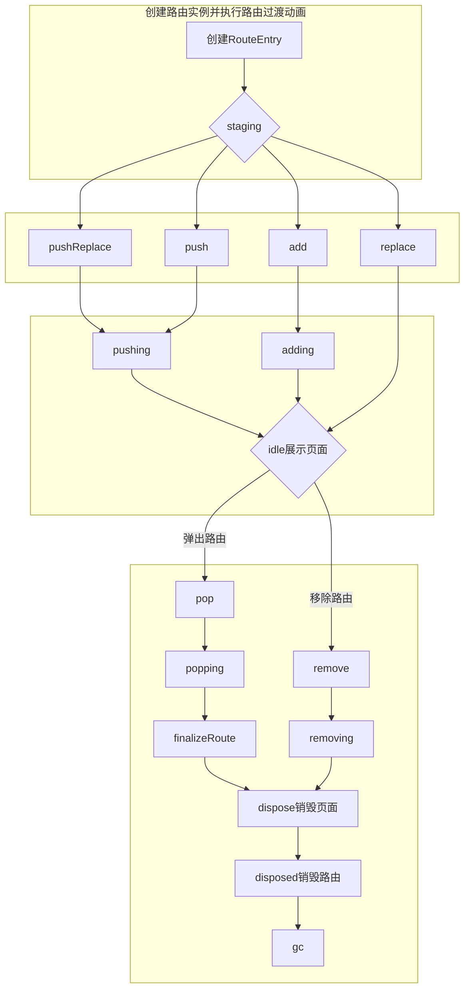
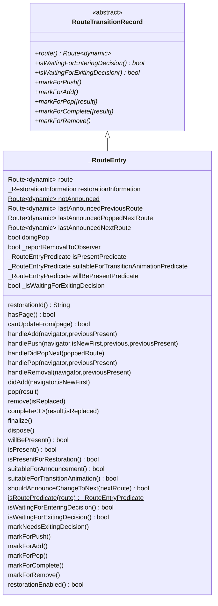

# Flutter路由

## 1.0版本:`Navigator`

1.0版本是在`MaterialApp`中使用`Navigator`来管理路由栈的方式，实际上在`MaterialApp`的`build`函数中使用的是`WidgetsApp`,然后在`WidgetsApp`的`build`函数中使用`Navigator`,我们在`MaterialApp`中常用的`initialRoute`、`onGenerateRoute`、`onUnknownRoute`、`navigatorObservers`等参数最终都会传递给`Navigator`

### 一、几种常用方式

#### 1、匿名路由

在`Navigator.of(context).push()`时push方法中的参数为`MaterialPageRoute`,代码如下:

```dart
Navigator.of(context).push(
    MaterialPageRoute<void>(
        builder: (BuildContext context) {
            return BookDetail(
                book: book,
            );
        },
    ),
);

```

#### 2、命名路由：路由列表`routes`

在`MaterialApp/CupertinoApp` 有个`Map<String, WidgetBuilder>`类型的参数`routes` ，当定义好与其相同类型的Map并传递给routes后即可通过`pushName()`进行路由跳转，Map集合的key即：路由页面的名称；value即：要跳转的页面. 完整路由代码如下：

```dart
void main() {
  runApp(App());
}

///匿名路由和命名路由
class App extends StatefulWidget {
  @override
  _AppState createState() => _AppState();
}

class _AppState extends State<App> {
  ///路由列表
  final Map<String, WidgetBuilder> _routes = <String, WidgetBuilder>{
    'list': (BuildContext context) => Route1MyHomePage(
          title: '列表',
          list: <Book>[
            Book('book1', 'author1'),
            Book('book2', 'author2'),
            Book('book3', 'author3'),
          ],
        ),
    'detail': (BuildContext context) => Route1BookDetail(),
  };

  @override
  Widget build(BuildContext context) {
    return MaterialApp(
      routes: _routes,
      initialRoute: 'list',
    );
  }
}

class Route1MyHomePage extends StatefulWidget {
  const Route1MyHomePage({
    Key? key,
    required this.title,
    required this.list,
  }) : super(key: key);
  final String title;
  final List<Book> list;

  @override
  _Route1MyHomePageState createState() => _Route1MyHomePageState();
}

class _Route1MyHomePageState extends State<Route1MyHomePage> {
  @override
  Widget build(BuildContext context) {
    return Scaffold(
      appBar: AppBar(
        title: Text(widget.title),
      ),
      body: ListView.builder(
        itemBuilder: (BuildContext context, int index) {
          final Book book = widget.list[index];
          return ListTile(
            ///传递参数
            onTap: () =>
                Navigator.of(context).pushNamed('detail', arguments: book),
            title: Text(book.title),
            trailing: Text(book.author),
          );
        },
        itemCount: widget.list.length,
      ),
    );
  }
}

class Route1BookDetail extends StatelessWidget {
  @override
  Widget build(BuildContext context) {
    final Object? argument = ModalRoute.of(context)?.settings.arguments;
    Book? book;
    if (argument is Book) {
      book = argument;
    } else {
      book = null;
    }
    return Scaffold(
      appBar: AppBar(),
      body: Center(
        child: Column(
          mainAxisSize: MainAxisSize.min,
          children: [
            Text('this is ${book?.title} detail; author is ${book?.author}'),

            ///匿名路由
            TextButton(
                onPressed: () {
                  if (book == null) {
                    return;
                  }
                  Navigator.of(context).push(
                    MaterialPageRoute<void>(
                      builder: (BuildContext context) {
                        return BookDetail(
                          book: book!,
                        );
                      },
                    ),
                  );
                },
                child: const Text('跳转下一页')),
          ],
        ),
      ),
    );
  }
}

class Book {
  Book(this.title, this.author);

  final String title;
  final String author;
}
```

#### 3、命名路由：`onGenerateRoute`的用法

**当同时使用`routes`和`onGenerateRoute`时，路由遍历顺序如下:**

- 先遍历`routes`列表,如果查找到则返回，不再去`onGenerateRoute`中查找
- 如果`routes`中未找到则去`onGenerateRoute`查找，找到则返回,不再执行`onUnknownRoute`,
- 如果`routes`和`onGenerateRoute`都未查找到则返回`onUnknownRoute`中定义的路由页面

```dart
///build中的写法如下：其余代码同上

  @override
  Widget build(BuildContext context) {
    return MaterialApp(
      // routes: _routes,
      initialRoute: 'list',
      onGenerateRoute: (RouteSettings settings) {
        if (settings.name == 'list') {
          ///没有返回值，泛型传void或者不传，不传则为dynamic类型
          return MaterialPageRoute<void>(

              ///需要RouteSettings，否则popUtil时将无法找到此路由
              /// final Object? argument = ModalRoute.of(context)?.settings.arguments;
              /// ModalRoute方法也无法获取参数
              settings: settings,
              builder: (BuildContext context) {
                return Route1MyHomePage(
                  title: '列表',
                  list: <Book>[
                    Book('book1', 'author1'),
                    Book('book2', 'author2'),
                    Book('book3', 'author3'),
                  ],
                );
              });
        } else if (settings.name == 'detail') {
          ///此时可以从RouteSettings中获取到push中传的参数
          /// final Object? arguments =   settings.arguments;

          return MaterialPageRoute<void>(
              settings: settings,
              builder: (BuildContext context) {
                return Route1BookDetail();
              });
        }
      },
    );
  }
```


### 二、Navigator

`Navigator`用来管理路由栈，其中包含：

#### 1. 静态路由函数

路由页面`push`或者`pop`都会通知`NavigatorOberver`和执行抽象类`Route`中的指定函数，具体见源码`navigator.dart`

##### 1.1、`pushNamed`

- 将指定名字的新路由推入，获取到`context`最近的路由。也就是`context`获取到的`NavigatorState`的历史路由列表中，最上方的路由(下同)
- 通知`Route`中的`didPush`和`didChanegNext`函数
- 如果添加了`Navigator.observers`,则会回调`NaviagtorOberver.didPush`函数
- 当新路由执行`pop`时，有 `Future<T>`类型的返回值
- 可选命名参数`arguments`，存放在`RouteSettings.arguments`中,可以通过`ModalRoute.of(context).settings.arguments`获取


##### 1.2、`pushReplacementNamed`

- 推入指定名字的新路由，并在新路由推入动画执行完毕后，替换旧路由
- 旧路由的退出动画不会执行
- 会把`result`参数传给旧路由，`dialog`和`popup menus`使用此机制返回选中的结果
- 会回调抽象类`Route`中的`didPush`和`didiChangeNext`函数；`NavigatorOberver`中的`didReplace`函数和
- 新路由推入动画执行完毕后会回调`Route.didComplete`函数
- `arguments`参数同`pushNamed`函数
- 开始推入新路由会取消旧路由内的手势


##### 1.3、`popAndPushNamed`

- 弹出旧路由并推入指定名字的新路由到栈中，旧路由执行`pop`
- 旧路由会执行退出动画，退出动画执行完毕时，新路由会执行推入动画，所以会短暂的看到旧路由
- 旧路由弹出会执行`Route.didPop`，`Route.didComplete`，`Route.didPopNext`，`NavigatorObserver.didPop`
- 新路由推入会执行`Route.didPush`，`Route.didChangeNext`，`NavigatorObserver.didPush`
- 新路由推入会取消旧路由内的手势
- `result`，`arguments`参数同`pushReplacementNamed`

##### 1.4、`pushNamedAndRemoveUntil`

- 推入指定名字的新路由，然后依次移除旧(从新路由下方开始，一直到栈底)路由直到`predicate`参数返回true
- 通过`ModalRoute.withName`确定`predicate`的返回值，如果栈内找到`withName`指定名字的路由则返回`true`
- `ModalRoute.withName`需要`RouteSettings.name`进行匹配
- 不能给被移除的路由传递结果,因为移除时不是执行的`pop`，而是使用`OverlayEntry.remove`
- 要移除推入路由下方的全部页面，只需要`predicate`返回`false`
- 新路由推入执行`Route.didPush`,`Route.didChangeNext`,`NavigatorObserver.didPush`
- 移除路由则回调`NavigatorOberver.didRemove`
- 当新路由`pop`时，会返回`Future<T>`类型的结果


##### 1.5、`push`

- 推入`route`参数指定的新路由

- 回调`Route.didPush`,`Route.didChangeNext`,`NavigatorObserver.didPush`

- 新路由`pop`时，会返回`Future<T>`类型的结果

  

##### 1.6、`pushReplacement`

- 推入`newRoute`指定的新路由，并在新路由推入动画执行完毕后替换旧路由

- 旧路由返回`result`参数

- 旧路由回调`Route.didComplete`

- 新路由回调`Route.didPush`,`Route.didChangeNext`

- 存在`NavigatorObserver`则回调`didReplace`

- 新路由执行`pop`会返回`Future<T>`类型的结果

  

##### 1.7、`pushAndRemoveUntil`

- 推入`newRoute`指定的新路由，然后依次移除旧(从新路由下方开始，一直到栈底)路由直到`predicate`参数返回true
- 其他同`pushNamedAndRemoveUntil`


##### 1.8、`replace`

- 将`oldRoute`参数指定的旧路由替换为`newRoute`参数指定的新路由
- 旧路由必须是不可见的，因为是直接替换，不会执行旧路由的退出动画。所以想要替换栈顶路由要使用`pushReplacement`函数，`pushReplacement`函数会设置延时时间直到旧路由的退出动画执行完毕，再推入新路由
- 回调`Route.didReplace`,`Route.didChangeNext`,`Route.didChangePrevious`,`NavigatorObserver.didReplace`函数
- 旧路由未执行完成(执行完成：路由由推入动画到推出动画执行完的过程)，就被移除所以旧路由不能返回参数
- 新路由`pop`时会返回`Future<T>`类型的参数

##### 1.9、`replaceRouteBelow`

- 把`anchorRoute`参数指定的路由替换为`newRoute`参数指定的路由
- `anchorRoute`是在路由栈内已存在的，不能直接进使用`MaterialPageRoute`，可以在`push`后把`MaterialPageRoute`存放在集合内，或者存放在指定变量中，以便`replace`和`replaceRouteBelow`使用
- 不能替换栈顶路由，使用`pushReplacement`替换栈顶路由
- `anchorRoute`没有返回值，因为其未执行弹出动画就被移除
- 回调`Route.didReplace`,`Route.didChangeNext`,`RouteChangePrevious`,`NavigatorObserver.didReplace`函数
- 新路由调用`pop`后返回`Future<T>`类型的返回值

##### 1.10、`canPop`

- 路由是否可以弹出，如果是栈底路由则返回false

##### 1.11、`maybePop`

- 根据`Route.willPop`的返回值来判断是否弹出路由
- `Route.willPop`返回`RoutePopDisposition.pop`,则执行`pop`弹出路由，`maybePop`返回`true`,表示处理了这个`pop`请求
- `Route.willPop`返回`RoutePopDisposition.doNotPop`,则不再执行任何操作，直接返回`true`
- `Route.willPop`返回`RoutePopDisposition.bubble`,则`maybePop`返回`false`,并且，调用者需要把请求发送到包含的范围内；如：退出app；
- 点击系统返回键会调用此方法
- `result`为返回给上一个路由的数据

##### 1.12、`pop`

- 弹出栈顶路由
- 首先调用`Route.didPop`，如果其返回`false`则不会弹出
- 通过`result`参数返回`Future<T>`类型的结果
- 会调用`Route.didComplete`,`Route.didPopNext`,`NavigatiorObserver.didPop`函数

##### 1.13、`popUtil`

- 弹出栈顶路由，直到`predicate`参数返回`true`
- 没有返回值
- `predicate`参数，通过`ModalRoute.withName`判断是否存在指定名字的路由

##### 1.14、`removeRoute`

- 立即移除`route`指定的路由,并调用其`Route.dispose`
- 回调`Route.didChangeNext`,`Route.didChangePrevious`,`NavigatorObserver.didRemove`
- 没有返回值，不会执行弹出动画
- `route`必须在栈内，未找到将会抛出异常

##### 1.15、`removeRouteBelow`

- 立即移除`anchorRoute`指定的路由，并调用其`Route.dispose`
- 没有返回值，不会执行弹出动画
- 必须在栈内，并且不能为栈顶路由，其下方必须存在至少一个路由;未找到该路由或者下方不存在其他路由或者是栈顶路由将抛出异常
- 会调用`Route.didChangeNext`,`Route.didChangePrevious`,`NavigatorObserver.didRemove`

##### 1.16、`of`

- 获取`NavigatorState`用来执行其内部函数如`pop`,`pushName`等
- 如果`rootNavigator`为`true`,则获取最远处的`NavigatorState`,否则获取`context`最近的
- 如果未获取到则在`debug`模式会抛出`FlutterError`,`release`模式则抛出异常


##### 1.17、`defaultGenerateInitialRoutes`

当`MaterialApp`或者`CupertinoApp`的`initialRoute`参数不为`null`时，`onGenerateInitialRoutes`使用默认的路由列表；

- 根据`initialRouteName`参数，获取指定的名字的路由
- 如果`initialRouteName`，使用`/`开头，则使用`/`分割路由名称字符串，然后通过分割后的字符查找指定名字的路由并存入`result`集合中
- 如果`initialRouteName`不是以`/`开头，则`allowNull`参数设置为`true`再次查找路由并存入`result`中
- 如果分割出来的路由名称对应的路由不存在，则移除它
- 如果最终未获取到任何一个路由，则会添加一个名字为`/`的默认路由


#### 2. Flutter 2.0 新增路由函数

以下函数作用见其同名函数，比其同名函数多了的功能是在状态恢复过程中，会根据定义好的规则来恢复路由状态

##### 2.1、`restorablePushNamed`

同`pushNamed`

##### 2.2、`restorablePushReplacementNamed`

同`pushReplacementNamed`

##### 2.3、`restorablePopAndPushNamed`：

同`popAndPushNamed`

##### 2.4、`restorablePushNamedAndRemoveUntil`

同`pushNamedAndRemoveUntil`

##### 2.5、`restorablePush`

同`push`，不过`route`参数换成了`RestorableRouteBuilder`参数，使用方式为:

```dart
 Navigator.restorablePush(
  context,
  (context,arguments){
   return MaterialPageRoute(
     builder:(context){
     return MyStatefulWidget();
   });
 },
  argument:'arguments',
 );
```

在状态恢复时，`navigator`会调用`RestorableRouteBuilder`重新构建新的路由

##### 2.6、`restorablePushReplacement`

同`pushReplacement`,`RestorableRouteBuilder`的使用同`restorablePush`

##### 2.7、`restorablePushAndRemoveUntil`

同`pushAndRemoveUntil`,`RestorableRouteBuilder`的使用同`restorablePush`

##### 2.8、`restorableReplace`

同`replace`

##### 2.9、`restorableReplaceRouteBelow`

同`replaceRouteBelow`

##### 2.10、maybeOf

同`of`


#### 3. 路由的状态机制

##### 3.1、从创建到销毁的流程图



##### 3.2、路由状态说明

通过枚举_RouteLifecycle定义了路由的状态，说明如下：

###### 3.2.1、staging

等待路由过渡动画执行完毕

###### 3.2.2、add

添加路由，通过`onGenerateInitialRoutes`或者`pages`方式添加，会调用`didAdd`函数

###### 3.2.3、adding

等待栈顶路由的`didPush`返回`Future`时

###### 3.2.4、push

执行`push()`函数添加路由，会调用`didPush`函数

###### 3.2.5、pushReplace

执行`pushReplace`函数添加路由，会调用`didPush`函数

###### 3.2.6、pushing

等待路由的`didPush`执行完成返回`Future`时

###### 3.2.7、replace

执行`replace`函数替换路由时，会调用`disReplace`函数

###### 3.2.8、idle

路由已添加完毕并且已展示

###### 3.2.9、pop

调用`didPop`函数

###### 3.2.10、remove

调用`didReplace`或者`didRemove`函数

###### 3.2.11、popping

等待路由执行完`finalizeRoute`函数，之后会切换到`dispose`状态

###### 3.2.12、removing

等待随后的路由动画执行完成，之后会切换到`dispose`状态

###### 3.2.13、dispose

暂时销毁路由(不是真正的销毁)，`disposed`时才是真正的效果

###### 3.2.14、disposed

真正的销毁路由，等待dartVM的GC

##### 3.3、`_RouteEntry` 路由实例



路由实例内部中处理了单个路由状态，提供了标记为指定状态的`mark`系列函数；恢复路由状态的`restoration`系列函数；标记当前路由状态为`xxing`、`idle`的`handle`系列函数；


## 2.0版本:`Router`

1.0版本的路由虽然能满足基本的需求，但是在一些特殊场景下，无法满足我们的需求，主要是不能自由操作路由栈，对系统返回键的监听不友好等等问题。因此google开发出了navigator2.0版本，2.0版本和1.0版本兼容，使用哪个要看项目需求


### 预定义路由栈方式
1. 在`MaterialApp` 中的`home`参数中使用`Navigator`，并且给`onPopPage`和`pages`参数传参。代码如下：
```dart

class _MyAppState extends State<MyApp> {
  Book? _selectedBook;
  bool show404 = false;
  List<Book> books = <Book>[
    Book('book1', 'author1'),
    Book('book2', 'author2'),
    Book('book3', 'author3'),
  ];

  @override
  Widget build(BuildContext context) {
    return MaterialApp(
      title: 'Flutter Demo',
      theme: ThemeData(
        primarySwatch: Colors.blue,
      ),

      ///navigator 2.0
      home: Navigator(
        onPopPage: (Route<dynamic> route, dynamic result) {
          if (!route.didPop(result)) {
            return false;
          }

          ///详情页点击返回时，清空选中
          setState(() {
            _selectedBook = null;
          });

          return true;
        },

        ///路由页面 (使用预定义路由栈)
        pages: <Page>[
          MaterialPage<void>(
            key: const ValueKey('BookListPage'),
            child: MyHomePage(
              title: '标题',
              list: books,
              onSelected: (Book book) {
                setState(() {
                  _selectedBook = book;
                  print('选中的 book ====${book.title}');
                });
              },
            ),
          ),
          if (show404)
            MaterialPage<void>(child: UnKnowScreen())
          else if (_selectedBook != null)

            ///自定义路由
            BookDetailPage<void>(_selectedBook!),
          // MaterialPage<void>(
          //     key: ValueKey(_selectedBook),
          //     child: BookDetail(
          //       book: _selectedBook!,
          //     )),
        ],
      ),
    );
  }
}

```
2. 添加页面`MyHomePage`、`BookDetail`和`UnKnowScreen`
```dart

class MyHomePage extends StatefulWidget {
  const MyHomePage(
      {Key? key,
      required this.title,
      required this.list,
      required this.onSelected})
      : super(key: key);
  final String title;
  final List<Book> list;
  final ValueSetter<Book> onSelected;

  @override
  _MyHomePageState createState() => _MyHomePageState();
}

class _MyHomePageState extends State<MyHomePage> {
  @override
  Widget build(BuildContext context) {
    return Scaffold(
      appBar: AppBar(
        title: Text(widget.title),
      ),
      body: ListView.builder(
        itemBuilder: (BuildContext context, int index) {
          final Book book = widget.list[index];
          return ListTile(
            onTap: () => widget.onSelected(book),
            title: Text(book.title),
            trailing: Text(book.author),
          );
        },
        itemCount: widget.list.length,
      ),
    );
  }
}


class BookDetail extends StatelessWidget {
  const BookDetail({Key? key, required this.book}) : super(key: key);
  final Book book;

  @override
  Widget build(BuildContext context) {
    return Scaffold(
      appBar: AppBar(),
      body: Center(
        child: Column(
          mainAxisSize: MainAxisSize.min,
          children: [
            Text('this is ${book.title} detail; author is ${book.author}'),
            TextButton(
                onPressed: () {
                  Navigator.of(context).push(
                    MaterialPageRoute<void>(
                      builder: (BuildContext context) {
                        return BookDetail(
                          book: book,
                        );
                      },
                    ),
                  );
                },
                child: const Text('匿名路由跳转下一页')),
          ],
        ),
      ),
    );
  }
}

class UnKnowScreen extends StatelessWidget {
  @override
  Widget build(BuildContext context) {
    return Scaffold(
      appBar: AppBar(),
      body: const Center(
        child: Text('page is not found:status is 404'),
      ),
    );
  }
}

```
3. 自定义路由动画
```dart
///自定义路由，继承page
class BookDetailPage<T> extends Page<T> {
  const BookDetailPage(this.book) : super(key: const ValueKey('bookDetail2'));

  final Book book;

  @override
  Route<T> createRoute(BuildContext context) {
    return PageRouteBuilder<T>(
        settings: this,
        pageBuilder: (BuildContext context, Animation<double> animation,
            Animation<double> secondAnimation) {
          final Tween<Offset> tween =
              Tween<Offset>(begin: const Offset(0, 1.0), end: Offset.zero);
          final CurveTween curveTween = CurveTween(curve: Curves.easeInOut);
          return SlideTransition(
            position: animation.drive(curveTween).drive(tween),
            child: BookDetail(
              book: book,
            ),
          );
        });
  }
}

```


## 路由路径解析、自定义路由代理，自定义路由过度
上方的预定义路由无法处理平台发送过来的路由路径，不能刷新web上显示的的URL的路径，因此需要使用`RouteInformationParser`和`RouterDelegate`来进行路由路径解析和刷新路由页面  

当自定义路由代理、和路径时，使用`MaterialApp`的`router`构造函数,传入自定义的`routeInformationParser`和`routerDelegate`参数。如果需要在路由过度期间进行特殊操作(如：关闭入场动画、给指定路由栈内的路由传参等)，则需要在Navigator的构造中传入`transitionDelegate`，通过继承`TransitionDelegate`抽象类来自定义路由过度代理

### `RouteInformationParser`

使用方式是，继承`RouteInformationParser<T>`抽象类,其中泛型`T`是我们定义的路由信息类;  
然后实现其中的两个函数`Future<T> parseRouteInformation(RouteInformation routeInformation);`和` RouteInformation? restoreRouteInformation(T configuration) => null;`

#### `parseRouteInformation`函数

 **以下内容为方法注释的翻译**

- 转化路由信息，并传递给`TransitionDelegate`
- 返回值为`Future`类型，就是接受异步计算获取路由（如：网络）
- 考虑使用`SynchronousFuture`返回结果，这样就不需要等待下一个`microtask`把数据传递到`RouterDelegate`

实现代码(和*Learning Flutter’s new navigation and routing system*中的相同)如下：

```dart

 @override
  Future<RoutePath> parseRouteInformation(
      RouteInformation routeInformation) async {
    final Uri uri = Uri.parse(routeInformation.location!);
    if (uri.pathSegments.isEmpty) {
      return RoutePath.home();
    }

    if (uri.pathSegments.length == 2) {
      if (uri.pathSegments[0] != 'book') {
        return RoutePath.unKnown();
      }
      final String remaining = uri.pathSegments[1];
      final int id = int.tryParse(remaining) ?? -1;
      if (id == -1) {
        return RoutePath.unKnown();
      }

      return RoutePath.detail(id);
    }

    return RoutePath.unKnown();
  }


```

#### `restoreRouteInformation`函数

从配置（即路由信息）中恢复路由

- 可以能返回`null`此时浏览器的历史记录将不会更新
- 此方法返回值不为`null`时，`parseRouteInformation`必须返回有相同的`route`

代码如下：

```dart
  @override
  RouteInformation? restoreRouteInformation(RoutePath configuration) {
    if (configuration.isUnKnown) {
      return const RouteInformation(location: '/404');
    }

    if (configuration.isHomePage) {
      return const RouteInformation(location: '/');
    }

    if (configuration.isDetailPage) {
      return RouteInformation(location: '/book/${configuration.id}');
    }

    return null;
  }
```


### `RouterDelegate<T>`路由代理


### TransitionDelegate路由过度时期的代理


参考文章1：
[Learning Flutter’s new navigation and routing system(需翻墙)](https://medium.com/flutter/learning-flutters-new-navigation-and-routing-system-7c9068155ade)
参考文章2：
[Flutter Navigator 2.0 指南与原理解析](https://flutter.cn/community/tutorials/understanding-navigator-v2#navigator-20)

