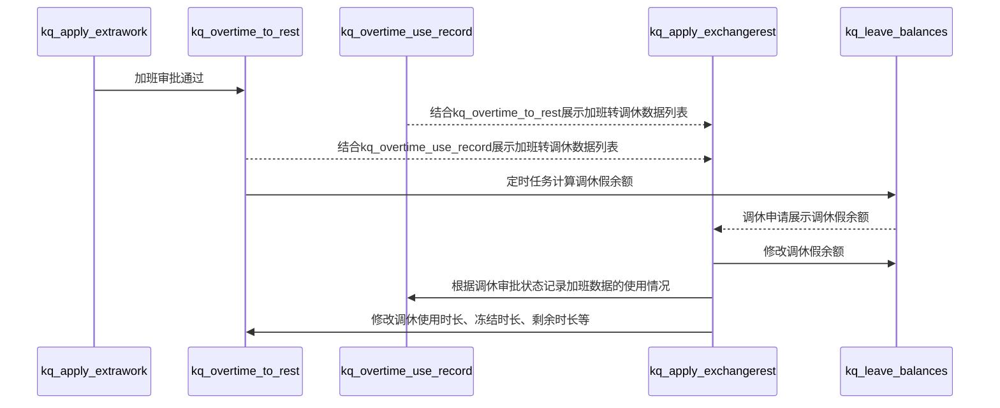

# 功能流程、时序图

## 1. 加班转调休时序图
> 1. kq_apply_extrawork: 加班申请表                       2. kq_overtime_to_rest: 加班转调休数据表
>
> 3. kq_overtime_user_record: 加班转调休信息使用记录表       4. kq_apply_exchangerest: 调休申请表
>
> 5. kq_leave_balances: 假期余额表

## 2.

